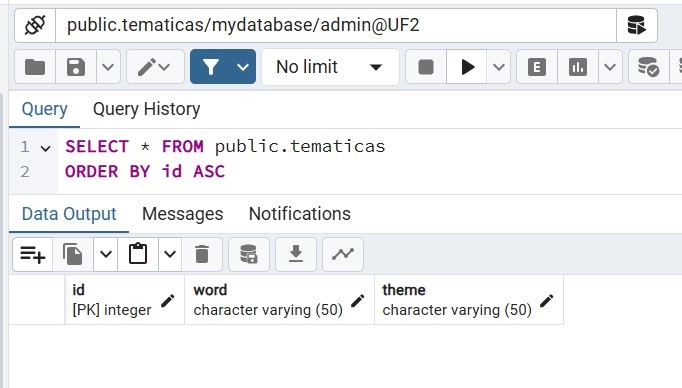

## Fitxer readme per l'Activitat 10

### Imatges de la pràctica

+ La taula _tematicas_ feta i encara sense cap data (insert)

+ La taula _tematicas_ després de l'insert de totes les dades del fitxer csv

+ Resposta de l'endpoint _penjat/tematica/options_ després de realitzar la consulta GET i retornar només les themes no repetides.

+ Resposta de l'endpoint _penjat/tematica/{option}_ realitza la consulta GET i retornar només una paraula random del tema triat.

