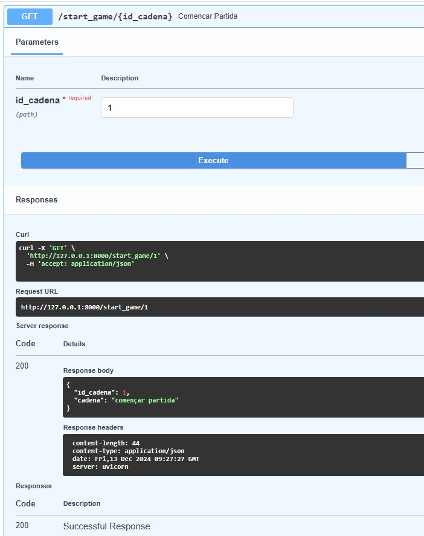

## Readme de la pràctica 11 de M7

### Dibuix de la base de dades amb les taules

+ Al començament no vaig entendre bé el que es demanava a la pràctica i després va resultar que per exemple en el segon i tercer exercicis només calia que el endpoint retornés un text que en aquest cas concret era _començar partida_. Aixó per un costat exigia tenir o fer una altra taula a la base de dades per desar o emmagatzemar aquest _string_ que després mitjançant un GET es recuperaria des de la base de dades i retornaria en format json per l'endpoint. Aquestes són les característiques de la nova taula Cadenas: 

+ El punt 2 i 3 de la pràctica demanen dos endpoints per renderitzar el mateix text, així que amb el mateix endpoint funcionaria, la qüestió és que després, el resultat es mostraria en un altre contenidor de visualització (js/html). Per tot això només faré un endpoint: start_game/id que retorna un json.
El resultat de l'endpoint start_game executat amb Swagger. Un cop retornat el json seria qüestió d'agafar el value de la key _cadena_.

+ L'exercici 4 de la pràctica: l'execució de l'endpoint _intents_ amb un mètode post.

+ Exercici 5: execució de l'enpoint abecedari amb Swagger. Un cop retornat el json seria qüestió d'agafar el value de la key _abecedari_.

+ Exercici 6: execució de l'enpoint estadistiques amb Swagger a partir de l'id del jugador. Aquest endpoint retorna els valors de l'espai d'estadístiques del jugador.
