## Aquest fitxer és el readme de la pràctica 9 de M7

### Llegint i provant la documentació de fastapi de l'apartat de body-fields (https://fastapi.tiangolo.com/tutorial/body-fields/)

+ El primer codi PUT de items/item executat amb postman:
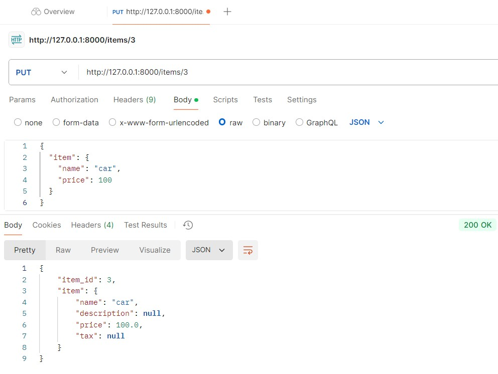

+ Ara estic executant el codi PUT incomplint la regla definida en el camp descripcio i apareix l'error de +300 caracters
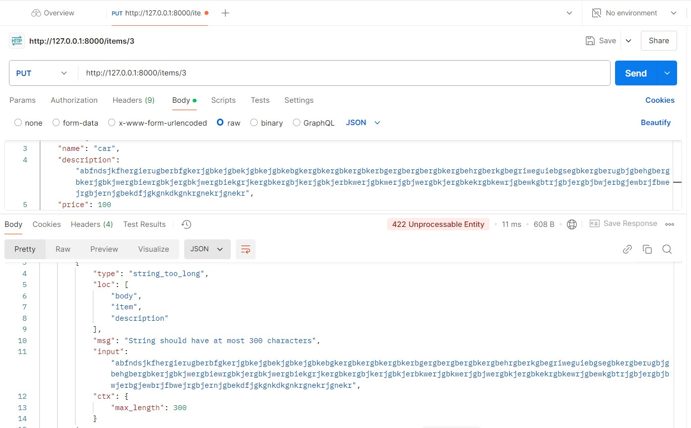

+ Ara estic executant el codi PUT incomplint la regla definida en el camp price i apareix l'error de només valors >0
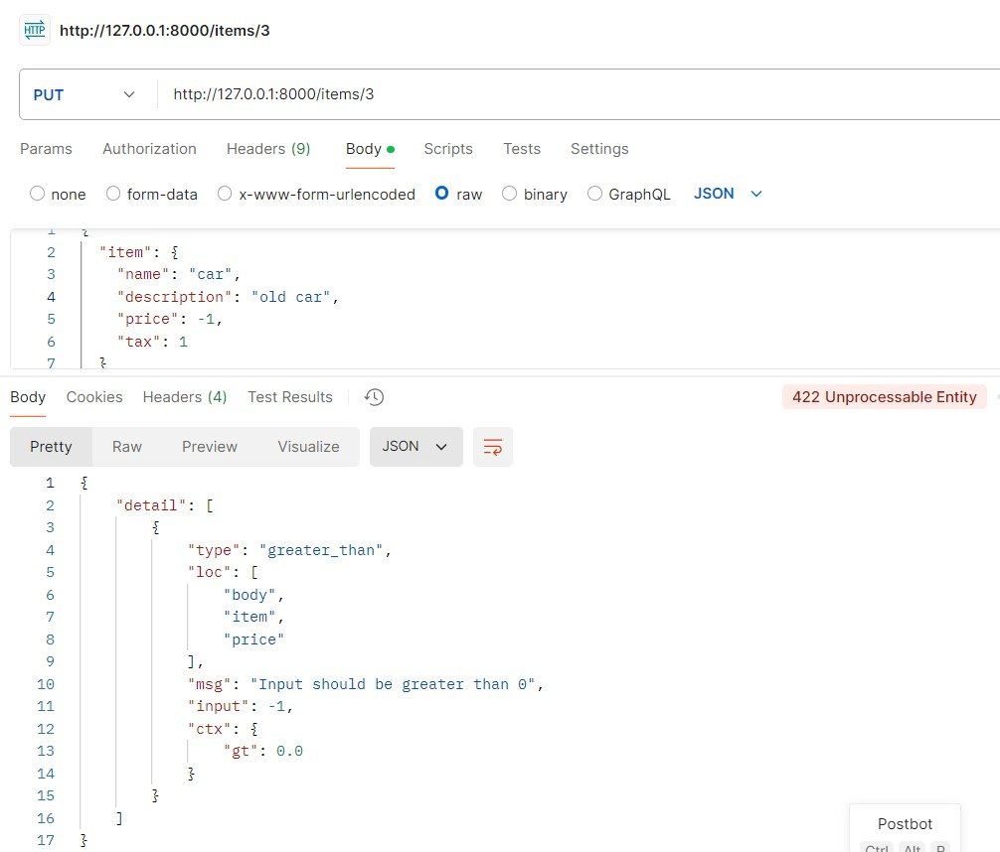

### Llegint i provant la documentació de fastapi de l'apartat de Body - nested models (https://fastapi.tiangolo.com/tutorial/body-nested-models/)
+ Es pot declarar un camp com una llista i amb tipus. 
En aquest exemple tenim un nou camp anomenat _tags_ de tipus _String_ que en ser-hi declarat com a llista de tipus set() que no admet repetits, retorna una llista amb valors únics.
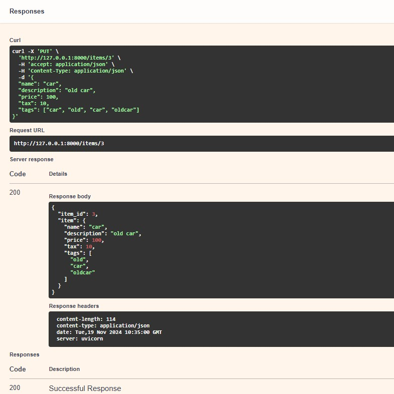

+ Models niats. Cada model dins de Pydantic té el seu tipus, però aquest tipus pot ser un altre model de Pydantic.
Es poden fer objectes json niats. En aquest exemple afegim un camp Imatge com a submodel de tipus Image
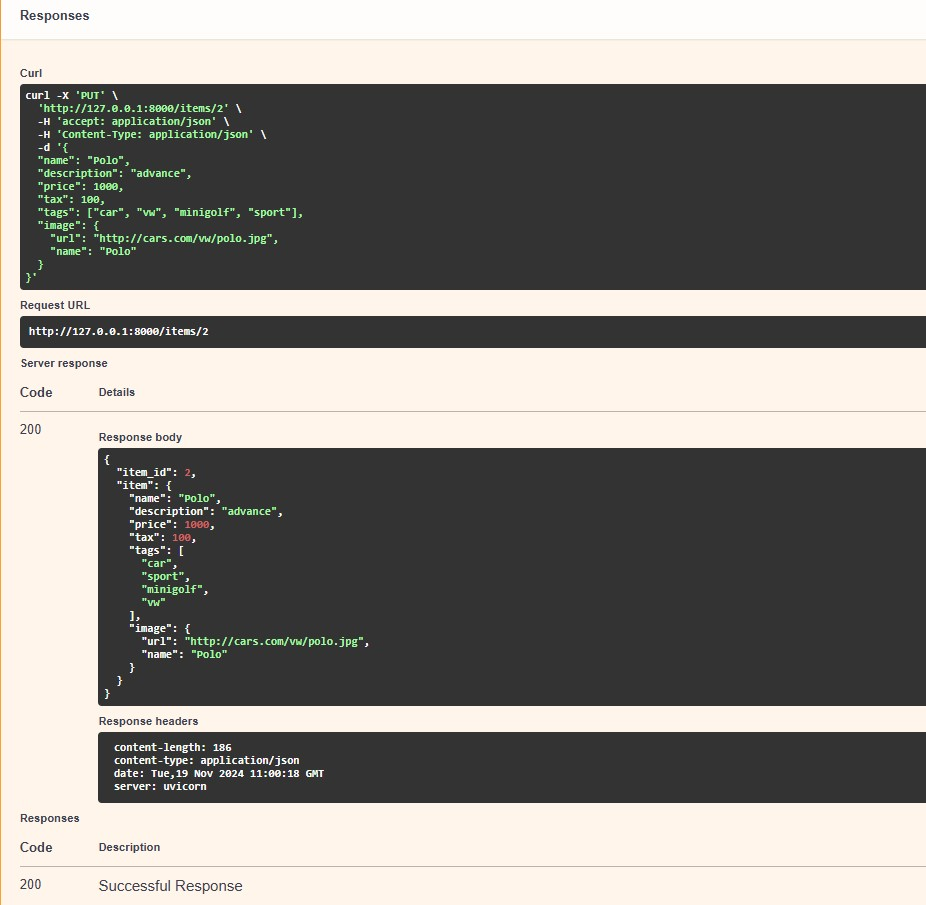

+ Com a continuació del punt previ, es pot utilitzar un submodel Pydantic amb subtipus com a llistes (list, set...).
En el següent exemple el camp Imatge passa a ser una llista d'imatges amb url i nom.
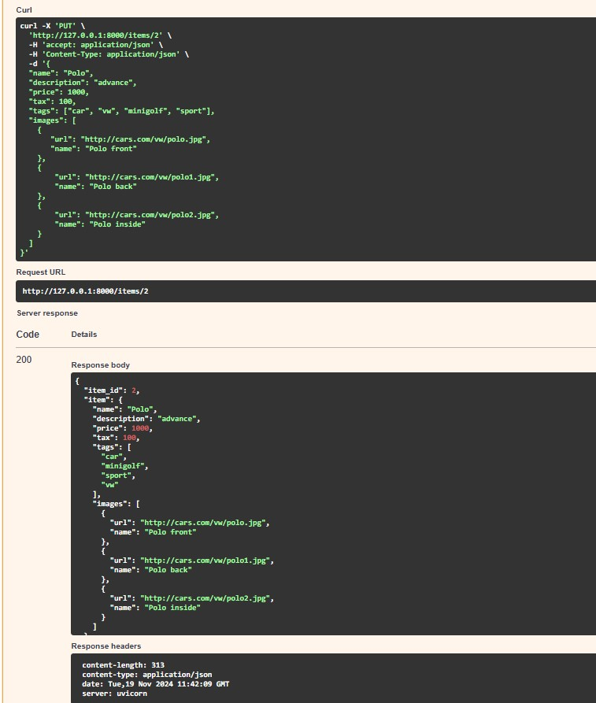

+ També es poden declarar més models niats, un dins l'altre.
En les següents imatges es pot veure el cos d'una oferta on tenim dos objectes o productes amb les seves llistes d'imatges.  
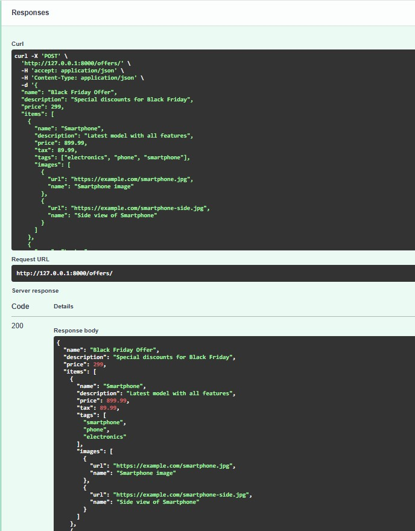
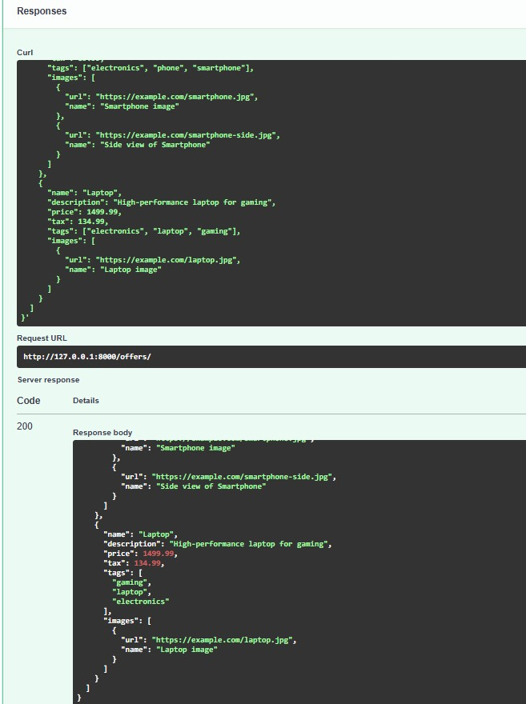

+ Es pot declarar el tipus en el paràmetre de la funció, igual que els models Pydantic:
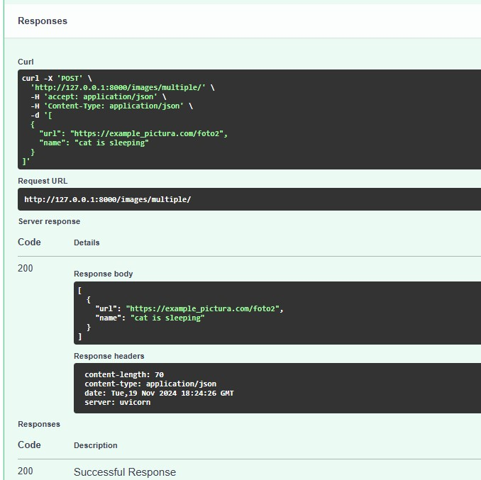

+ Aquest endpoint accepta tots els diccionaris amb key de tipus: int i les values de tipus: float.
En el primer cas, li passem un diccionari amb tipus de valors correctes i retorna el dict bé, però 
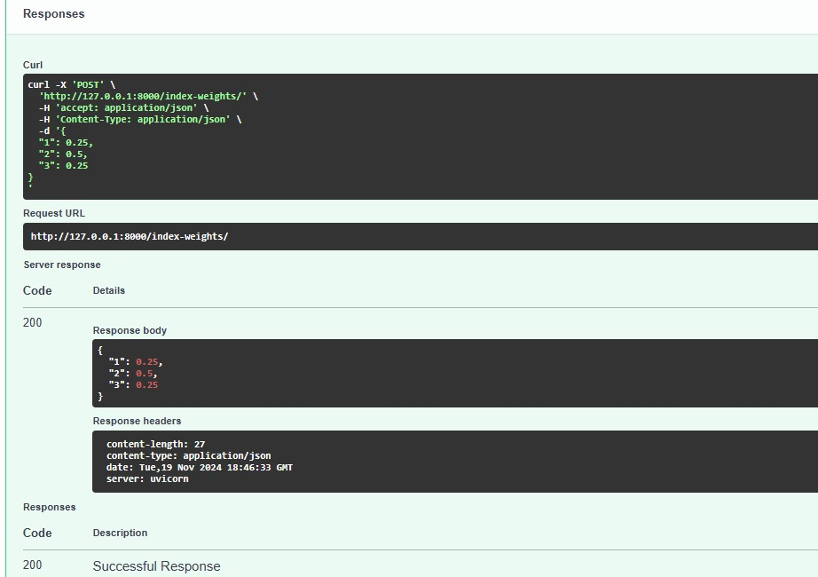
en el segon cas, un dels key o clau no té el tipus correcte i apareix l'error de tipus: la clau ha de ser de tipus integer / int.
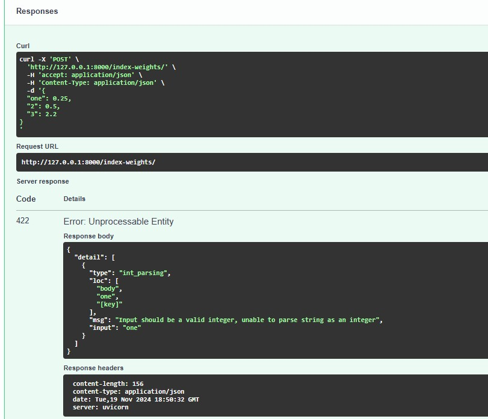

