# uf2_fastapi

## Activitat 8 de M7 d'Angel Ivanov

### Imatges de la pràctica

+ _Imatges de l'execució del mètode get("/item/{id_item}") amb Swagger i Postman:_
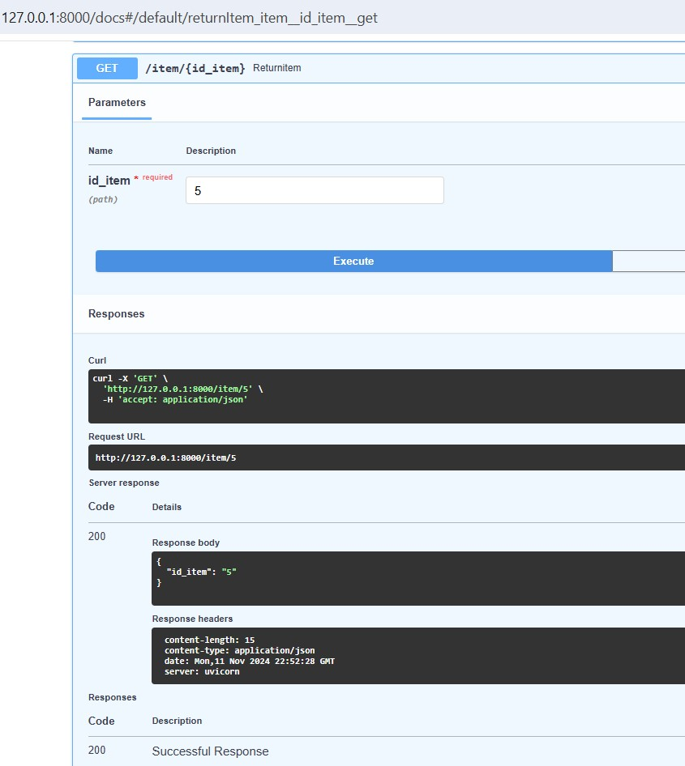
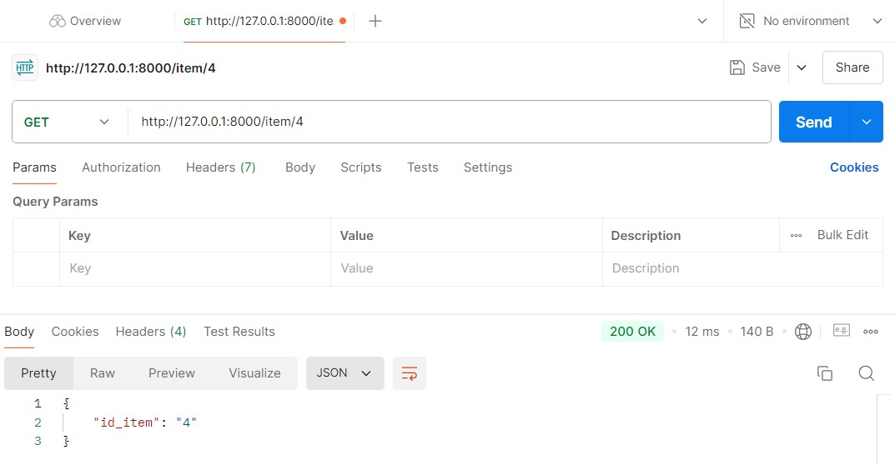
+ _Imatges de l'execució del mètode post("/persona/") amb Swagger i Postman:_
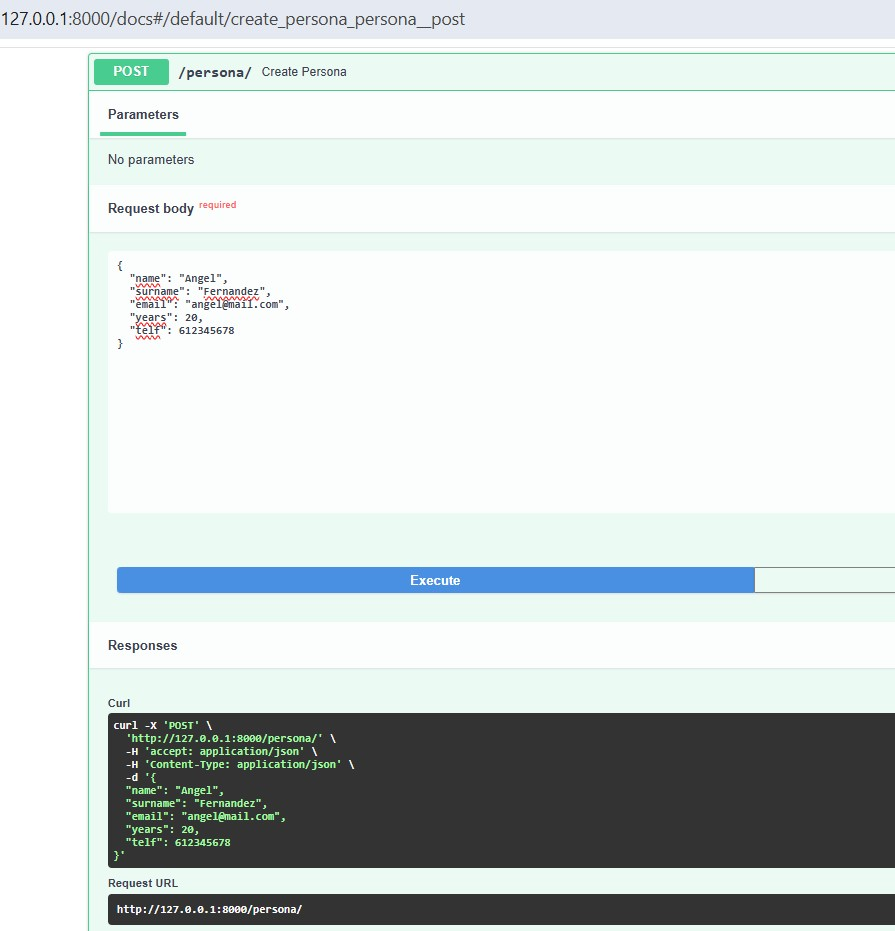
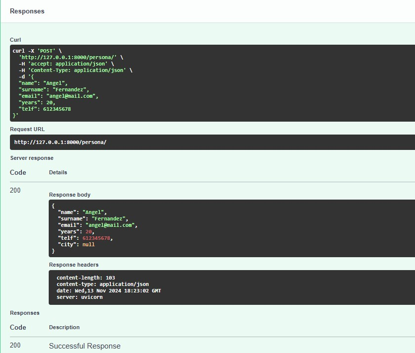
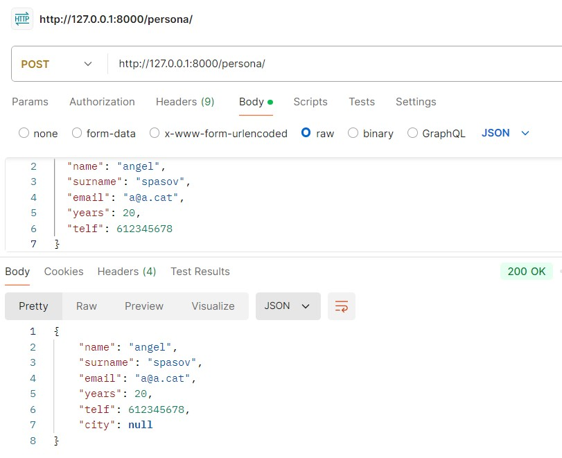
+ _Imatges de l'execució del mètode get("/alumne/{id}", status_code=404) amb Swagger i Postman:_
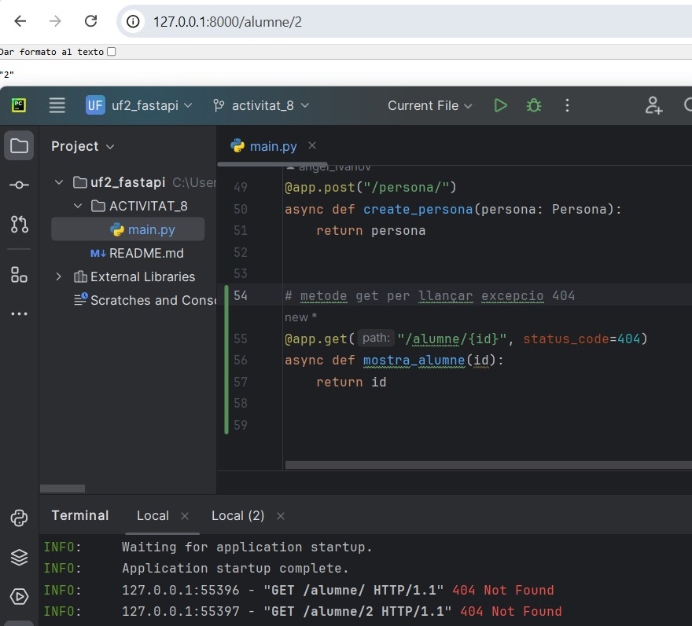
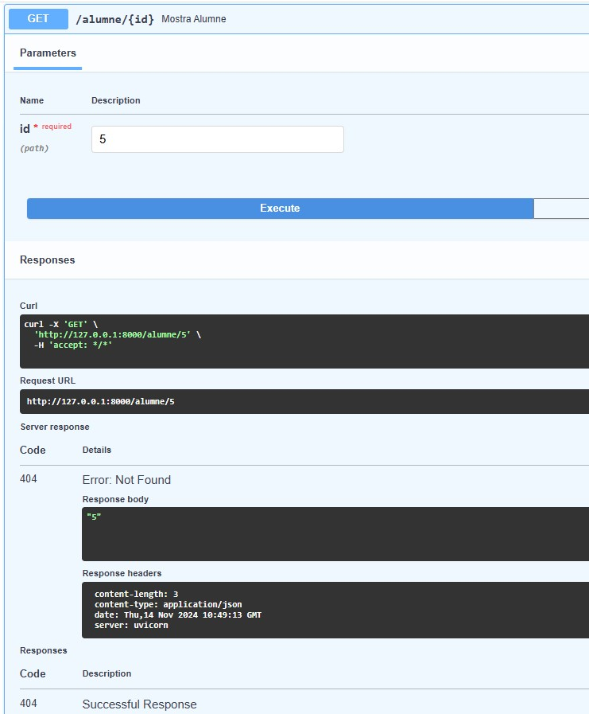
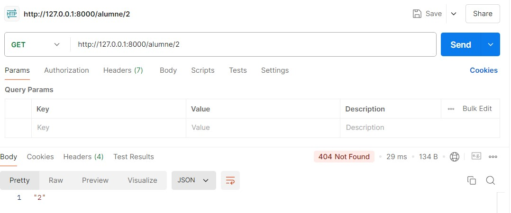
+ _Imatges de l'execució del mètode get("/alumno/{id}") i HTTPException amb Swagger i Postman:_
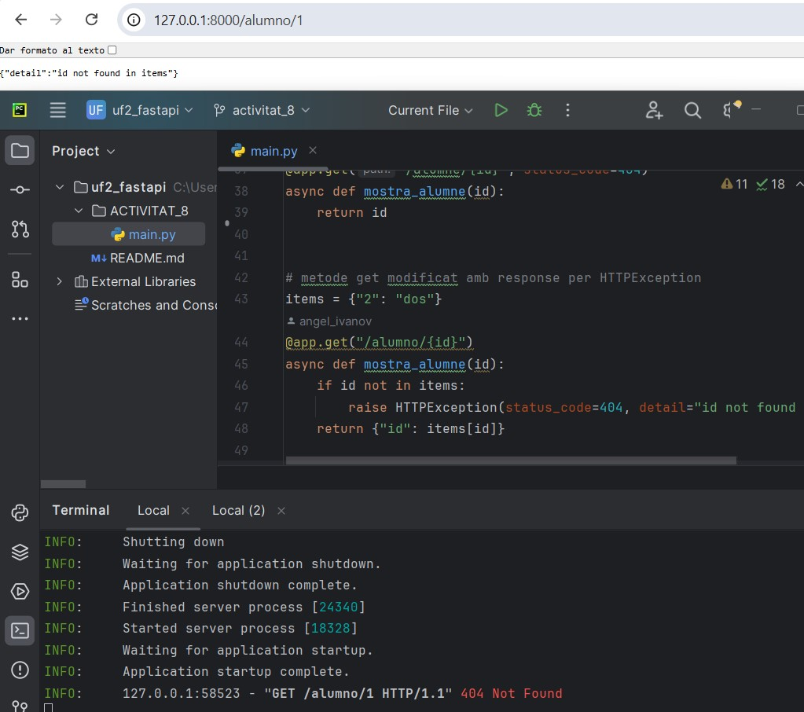
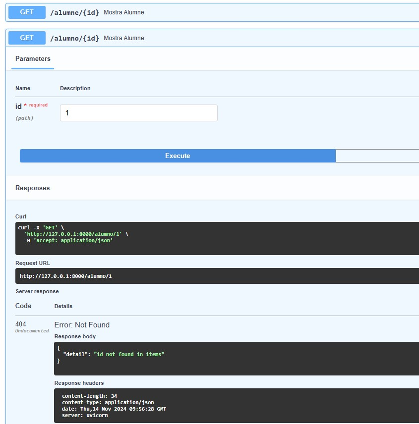
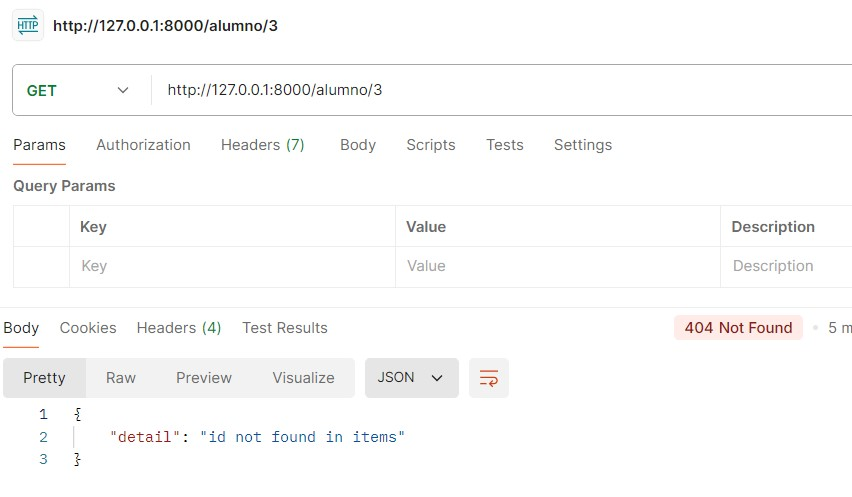